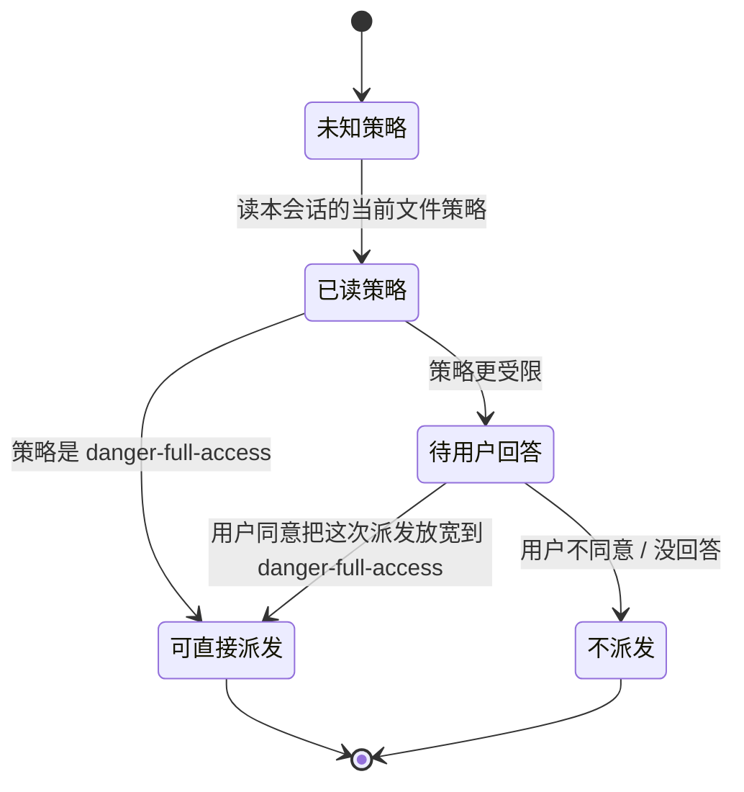

## 职责与边界

负责：把「用 Chromium 系浏览器（Chrome / Brave / Edge）做一次需要登录态的网页交互」收敛成**确定性的一组值和一个命令行契约** —— 规范 profile 路径、调试端口、浏览器可执行文件、运行模式、启动参数、实例的复用 / 启动 / 换模式决策，一条最小 CDP 通道（navigate / evaluate / screenshot），以及标签页卫生。唯一命令行入口是 `browser/cli.mjs`。

不负责（逐条防越权）：

- 不拥有浏览器：用的是**系统已装的** Chromium 系浏览器，标准安装位置探测 + `ADG_CHROME` 覆盖，不下载、不安装、不打包。
- 不拥有用户浏览器里**既有的**标签页：只关自己刚开的临时页、以及调用方用 `--match` / `--tab` 点名了的页（I8 / I10）。「哪一页已经不需要了」这种语义判断不在本模块。
- 不拥有 profile 里的登录态：只**指向**一个目录，从不读写其中的 cookie 库、不导出凭据、不给任何站点代填账号密码 —— 登录永远由人**在有头窗口里**完成（所以「默认无头」不是「不许登录」）。
- 不拥有沙箱与权限：本机文件策略下浏览器起不起得来是 host 平面的事实，本模块只能在失败时**如实报错**，不降级、不换参数重试。**无头不是绕开它的路径**：受限令牌下有头无头死在同一条内部 IPC 上。
- 不拥有「这里需不需要人工」这个判断：什么时候必须换成有头窗口由**子代理**按站点信号决定（登录墙 / 验证码 / 挑战页 / 二次验证；这套信号写在 `skills/adg-browser-use/SKILL.md` 里），本模块只执行**换模式**这个动作并把状态如实报出；换成有头之后人在窗口里做什么也不属于本模块。
- 不拥有用户问答通道：撞上登录墙时的**转达**由调度者做（见 `preset/design.md` 的「非功能红线」一节里那条**「请用户手动登录」不是失败路径、派发前不得预先禁止登录**的规定），本模块只负责把窗口开好、把状态报出。
- 不拥有预设与部署：调度 persona 与 `skills/adg-browser-use/SKILL.md` 引用本模块的命令行契约，`install.ps1` / `install.sh` 把它拷到用户根 —— 两者都不是本模块的一部分。
- 不做浏览器指纹伪装、不做验证码识别、不做反检测（见「非功能红线」）。

## 依赖关系

- 依赖：Node 内建的 `node:child_process` / `node:fs` / `node:path` / `node:os`，以及两个**全局**对象 `fetch` 与 `WebSocket`（后者要求 Node ≥ 22；`lib/cdp.mjs` 的 `assertRuntime()` 显式报错，不静默降级）。**无第三方包依赖**。
- 被依赖：
  - `skills/adg-browser-use/SKILL.md` 按本模块的命令行契约指导浏览器交互（调度者派发带浏览器能力的子代理时把它的绝对路径写进委派 `prompt`，要子代理先 read 再动手）—— 技能只写命令与纪律，不复制完整选项表（只举常用命令与少数选项）；
  - `install.ps1` / `install.sh` 把 `browser/` 拷到 `${DSH_HOME:-~/.dsh}/browser/`，部署落点与仓库路径同名，少一层映射；
  - `browser/AGENTS.md` 是改这个模块的入口，「生效方式」一节给出部署后的复核命令。
- 跨模块改动路由：改命令行契约（命令名、输出行、退出码）前先读**调度 persona 的【浏览器：模式】/【浏览器：权限】两段**与 `skills/adg-browser-use/SKILL.md`；改 `launch` / `close` 的默认行为（**尤其默认模式**）前先读 `preset/design.md` 的「非功能红线」一节里这三条规定 —— **禁止删掉或绕过浏览器任务的权限闸门**（且闸门是提示级、不是安全边界）、**浏览器模式由调度者在派发前判定并写进委派**、**「请用户手动登录」不是失败路径、派发前不得预先禁止登录** —— 确认没有把闸门或「登录由人完成」的分工写坏。

## 核心数据模型

### BrowserTarget（不可变值对象）

一次调用要驱动的「哪个浏览器」：`profile`（绝对路径）、`port`、`chrome`（可执行文件绝对路径）、`mode`（目标运行模式）、`args`（启动参数数组）。创建后冻结，改 = 用新的输入重新解析。解析由 `browser/lib/target.mjs` 的纯函数完成。

- **I1**：profile 只能来自**显式配置**（`--profile` / `ADG_BROWSER_PROFILE`）或**规范默认** `<DSH_HOME>/browser-profile`；禁止任何随会话工作区漂移的推断（相对路径只在 `--profile` 显式给出时按 cwd 解析）。来源：profile 若跟着工作区走，换一个工作目录登录态就当场清零 —— 这正是「浏览器代理经常被登录拦住」的直接成因。载体：[机检] 单元用例（默认路径、与 cwd 无关、显式优先、`DSH_HOME` 缺省）。
- **I2**：启动参数禁止出现伪装 / 降权旗标（`--no-sandbox`、`--disable-blink-features=…`、`--user-agent=…`、`--disable-web-security`）。来源：本模块只连不启、自己管 profile，这几个旗标零收益却会削弱隔离与可识别性。注意口径是「**不需要**」而不是「可以加」：全访问下 `--headless=new` 裸起即可（无头不需要 `--no-sandbox`）。载体：[机检] 单元用例（参数里既有 `user-data-dir` / `remote-debugging-port`，也不含上述旗标）。
- **I3**：端口非法值（非整数、< 1、> 65535）禁止静默回落到默认值。来源：静默回落会让两个不同的实例占同一个默认端口，或让调用方以为自己连的是 A 其实连的是 B。载体：[机检] 单元用例（非法值抛错、合法值的优先级）。

### BrowserMode（值对象）

一次启动要用的**运行模式**：`headless`（工具默认）或 `headed`。模式不是可以事后猜的状态 —— 活着那个实例的模式由 CDP `Browser.getVersion` 返回的 `userAgent` 读出（`/Headless/i` 一条判据对 Chrome / Brave / Edge 通用），不需要状态文件。

- **I4**：**工具默认无头；换模式必须由调用方显式要求，且只有一条换法**。
  - ① 不给 `--headless` / `--headed` 时一律无头（也可用 `ADG_BROWSER_MODE` 指定；非法值直接报错、不回落 —— 与 I3 同口径）。
  - ② 活着的实例与目标模式**相同**、模式**读不出来**（`unknown`）、或**模式不同但调用方没有显式要求模式** → 一律**复用**，绝不为了「顺便统一模式」去动它（unknown 分支标 `modeUnverified`、未显式分支标 `modeNotRequested`，两者都在输出里说明「没有动它」并给出显式换法的命令）。来源：不带旗标的 `launch` 是子代理最常打的那条命令，而它撞上「用户正在有头窗口里登录」就会砸掉现场。载体：[机检] 单元用例（同模式复用、未知模式复用、未显式要求时不动活实例、显式才允许换）+ [评] 调度 persona 的「浏览器：模式」/「浏览器：权限」两段与 `skills/adg-browser-use/SKILL.md`，以及 `preset/design.md` 的「非功能红线」一节里那条**浏览器模式由调度者在派发前判定、写进委派**的规定。
  - ③ 只有**显式请求的另一种模式**才换（单次 `--headless` / `--headed`，或环境变量 `ADG_BROWSER_MODE`；判定在 `modeIsExplicit`），换法只有一条：`Browser.close` 优雅关掉（登录态落盘）→ 等端口落下 → 用**同一个 profile、同一个端口**按目标模式重开。理由是硬事实：一个 profile 同一时刻只能有一个实例 —— 第二个进程要么把启动请求转交给活着的那个然后自己退 0，要么直接失败退出（有头第二个实例退 0 且每次都多开一个页，无头第二个实例退 21）。**代价写在明处**：换模式只保住带 `expires` 的持久 cookie，会话 cookie、未提交的表单与 SPA 内存态都会丢。
  - ④ 启动参数必须由 `launchArgs` 构造且**非空**。空 argv 等于「不带任何参数启动浏览器」——那是浏览器**自己的默认 profile**，请求会被转交给用户日常那个实例（形态：换模式那条路一直 `exit=0`、调试端口从未起来、用户侧反而多出窗口）。所以 `planLaunch` 的 `switch` 与 `start` 一样必须给出 `args`，调用方在 spawn 前还要再拒一次空数组。载体：[机检] 单元用例（`switch` 分支带目标模式参数、模式优先级与非法值、spawn 前拒绝空 / 非数组参数）。

### 人员放行（受控操作对象）

「这一次能不能起浏览器」不由本模块决定，它是**调度方在派发前**要过的一道门：

- 每个状态**它不是什么**：`可直接派发` **不是**「安全」；`待用户回答` **不是**「被拒绝」；`不派发` **不是**「浏览器坏了」——是这一次没被放行。
- 迁移唯一入口：由**调度方**在派发带浏览器能力的子代理之前走一遍；本模块不持有这道门，也无权改动它（子代理不能给自己放宽权限，见下）。
- **口径不许写偏**：这道门**不是安全边界**，是一条部署前提 —— 受限令牌下浏览器根本起不来，问用户是为了让这次派发能成，不是防谁。**运行模式不在这道门里**：它由调度者在派发前判定（见下面那条非功能红线），别把两件事并成一次提问。
- 这道门为什么必须由调度方过：被委派的子代理**不能问用户**（`ask_user_question` 对非 live runtime root 抛 `DELEGATED_CALLER`，错误文本是 `human interaction is unavailable while the calling agent is owned by another live agent; include the unresolved question or decision in the child agent's final result`），也不能用 `sandbox_permissions` 给自己升权（子会话的审批策略被钉成 `never`），而且父级切权**不会**影响已经在跑的子代理（新权限只对切换之后**新开的**子代理生效）。这些是源码级事实，不是行为观测；本模块的判据不依赖它们。
- **这不代表登录要事先问过**：调度方事前**不得**预先禁止登录，撞上登录墙时按「人工介入」办（规定出处：`preset/design.md` 的「非功能红线」一节里那条**「请用户手动登录」不是失败路径、派发前不得预先禁止登录**的规定）。

**未观测**：调度者是否真的在派发前读过策略、受限时是否真的先问过用户；量法：在受限会话的转写里检索 `ask_user_question` 与该次浏览器能力委派（`delegate` 调用）的时间先后。

### BrowserInstance（生命周期型）

端口上的那个浏览器进程。本模块**不持有**它的 pid —— 启动进程可能先退出而浏览器还活着，定位只能靠端口与 profile。

- 属性：`port`、`profile`、`chrome`、`browser`（CDP 报回的版本串，absent 时未知）、`mode`（由 UA 读出的 `headless` / `headed` / `unknown`，absent 时未知）。
- 状态机：`absent` → `starting` → `live` → `closed`
  - `absent`：端口上没有任何 CDP 端点。**它不是**「没有浏览器在跑」—— 用户日常的浏览器就在跑，只是没有调试端口。
  - `starting`：已 spawn，正在等 `/json/version` 起来。**它不是**「可用」：这期间任何页面操作都必须先失败。
  - `live`：`/json/version` 可达。**它不是**「当前页已登录」—— 登录是与站点之间的事，本模块无从判断。
  - `closed`：`Browser.close` 之后端口不再可达。**它不是**「数据丢了」：优雅关闭正是登录态落盘的时刻。**端口先落、进程后走**（端口不可达发生在进程真正退出之前很久），所以「端口没了」不等于「锁放了」；换模式等的正是端口落下这一步。
  - 迁移唯一入口：`absent|closed → starting → live` 只能由 `cli.mjs launch` 触发；`live|starting → closed` 只能由 `cli.mjs close` 触发，或者由 `cli.mjs launch` 的**显式换模式**触发（I4 是这条唯一入口的唯一例外：它自己先关后开）。禁止绕过对象直接改状态 —— 手工 kill 会跳过落盘。
- **I5**：`live` 时禁止重启。`launch` 必须先探测端口，活着就**复用**并按需补开标签页。来源：重启会丢内存里的会话态、并逼用户重新登录，而「用户刚登录完」正是最不该被打断的时刻。**唯一例外是 I4 的显式换模式**：那不是「重启」，是模式迁移，且只有这一条路。载体：[机检] 单元用例（复用分支不产生启动参数）+ [评] 人工 review。
- **I6**：关浏览器只有一个入口（`closeBrowser` → `Browser.close`）。`PageSession.close()` 只断开 CDP 连接，**禁止**关浏览器。载体：[机检] 源码级单元用例。

### PageSession（句柄型）

一次「连上某一页并操作它」的句柄：短生命周期，对外只暴露 `goto` / `text` / `evalJs` / `shot` / `close`，外加 `created` 标记（这一页是不是本次调用自己开的 —— I8 的判据）与 `target`（被操作的页面目标）。

- 状态机：`open` → `closed`。迁移唯一入口：`pageSession()` 创建、`close()` 结束；`open` 调 `close`、`closed` 再调 `close` 都是自环（幂等）。
- **I7**：页面选择必须**确定性**且**不可猜测**：只认 `type === 'page'`、带 `webSocketDebuggerUrl`、非 `devtools://` 的目标；`--match` 未命中、`--tab` 越界或为负、目标列表为空，四种情形都必须报错，禁止「随便挑一页」。来源：挑错页会把操作落在用户正在用的那个标签上，而调用方看不出差别。载体：[机检] 单元用例（四类选页失败）。
- **I9**：CDP 通道的协议行为必须守四件事：请求按 `id` 关联（乱序返回各归各位）、CDP 错误映射成**带方法名**的 `Error`、事件通知与未知 `id` 被忽略、连接关闭后 `send` 与在途请求都拒绝。载体：[机检] 单元用例（可注入假 socket，不需要浏览器）。

### PageTab（清理型）

一个**标签页目标**，以及「谁有权关掉它」。不拥有它的语义价值，也不判断它还需不需要。

- 状态机：`open` → `closed`。迁移唯一入口：`Target.createTarget` 创建、`Target.closeTarget` 关闭 —— 后者必须在**浏览器级**端点上发（页面级端点关不掉别人，也关不掉自己所在的 target）。幂等：已关闭的 target 再关一次不报错。
- **I8**：关标签页必须**显式点名**，且**不许关到 0 个页面**。`close-tab` 只接受 `--match <子串>`（关掉所有匹配的）或 `--tab <n>`（关那一个）；不给选择器、没命中、越界、缺值、以及「这一关会剩下 0 个页面」五种情形一律报错。最后一条是护栏：把页面关到 0 个会让浏览器自己退出，那等于**绕过 `close`**（而 `close` 才带着「登录态落盘」的语义）。载体：[机检] 单元用例 + [人] 用量护栏现场验（只剩一个页时拒绝关闭）。
- **I10**：**谁开的谁收**：`text` / `eval` / `shot --url <新地址>` 为读一页而开的临时标签，命令结束时要自己收走（`--keep` 明确要留才留）；`open` / `launch` 开的页**不**自动关（它们是「把窗口留给用户」的动作）。判据是 `pageSession` 的 `created` —— 没有它就分不清「这一页是我开的」与「这一页用户早就开着了」，而后者绝不能被自动关掉。**两半补充**：① **不许抢跑**：临时页必须先在 `about:blank` 建、attach 之后再 `Page.navigate` 并等可读状态 —— 按目标 URL 建页再固定等一段时间就读，会把「抢在加载前读」变成一页空正文，而空正文与「这页本来就空」在调用方看来一模一样，会白烧一整轮，所以等不到可读状态必须**报错**而不是返回空正文。② **失败路径同样「谁开的谁收」**：初始导航失败或超时时，`pageSession` 自己关掉那个临时页（只关 `created` 的），别人开的页一律不碰。载体：[机检] 单元用例（`created` 标记、收尾只关自己开的页且受 `--keep` 控制、空白页起手、失败路径收页）+ [人] 真机看 `TABS=` 与 `TAB_CLOSED=`。
- 边界（I8 / I10 都适用）：本模块**不判断**哪一页「已经不需要了」。它只关 (a) 自己刚开的临时页、(b) 调用方点名匹配的页 —— 语义判断留给子代理（收尾时点名清站点），护栏留在工具侧。

## 动作层与判据（DOM 可观测差异）

五条动作命令（`click` / `hover` / `type` / `select` / `wait-for`）与它们共用的判据层。这是**最小动作闭环**：只做到「点一下、把指针移进一个元素、输入一段、选一个选项、等一个条件成立」。**未纳入本次**（要另开设计）：网络拦截 / 请求改写、cookie 读写、文件上传 —— 它们要么需要本次没有接线的域（`Fetch.*` / `Storage.*` / `DOM.setFileInputFiles`），要么需要人在场的判断。

### 动作的四条实现口径（改了要连文档一起改）

- `click` 走 `Input.dispatchMouseEvent` 的 `mousePressed` + `mouseReleased`（`DISPATCHED=2`）：这是**真实输入事件**，经过浏览器的命中测试，等价于用户真按了一下鼠标。不用 `element.click()` 或页面内 `dispatchEvent` —— 那是合成事件，页面用 `isTrusted` 就能分辨，而且不经过命中测试（点被浮层盖住的元素也照样"成功"）。
- `hover` 走 `Input.dispatchMouseEvent` 的 `mouseMoved`（`DISPATCHED=1`）：**只发指针位移、不按任何键**（显式 `buttons: 0`、不给 `button` 字段），因此是一次真正的"指针移进元素"，页面按 `mouseenter` / `mouseover`（以及 `:hover` 的样式计算）处理。它是**真实输入事件**，同样经过命中测试 —— 那条链上的页面反应（内联 `$().hover(...)`、框架的 `onMouseEnter`、纯 CSS `:hover`）只有真指针进得去才会发生，`element.dispatchEvent(new MouseEvent('mouseenter'))` 这类合成事件会被 `isTrusted` 分辨且不触发纯 CSS `:hover`。**不在 `click` 前顺手补一次 `mouseMoved`**：`click` 现有的两次事件序列是既有契约（既有页面与用例都按它读），改它等于改所有既有闭环的读数口径；要用指针进入就显式跑 `hover`（这也是"登记为未纳入、不顺手扩面"的同一条纪律）。代价与 `click` 同源：**`DISPATCHED=1` 只说明事件写出去了**，指针过去之后页面是否真的展开 / 变样式，仍只由 `CHANGED=` 那三态说话（**判据的边界不是"样式 vs 非样式"，而是"这次变化有没有落在可比字段上"**：`display:none → block` 会把子元素文本带进 / 带出 `document.body.innerText`，所以展开类效果（下拉 / 折叠 / 带文本的浮层）判据**看得见** —— 真机实测（零 JS 的独立 fixture）`.item:hover .clist { display: block }` ⇒ `CHANGED=true`、`dom=413cbfd5/6 → def1f051/14`、`REASON=可观测差异：dom / elemtext`；真正读成 `false` 的只有**不改 `innerText` 的纯视觉属性**（`opacity` / 配色 / 边框 / 阴影 / `transform` —— 实测 `.item:hover .sub { opacity: 1 }` ⇒ `CHANGED=false`，而回读 `subOpacity` 从 `"0"` 变 `"1"`）。`CHANGED=false` 只说明判据没看见，不等于没发生，见下「判据域到此为止」）。
- `type` 走 `Input.insertText`（`DISPATCHED=1`）：**一次插入整段文本**，中文 / emoji / 组合字符不会被拆成半个码位，也不经过输入法状态。代价是**不触发逐键的 `keydown` / `keyup`**（只触发 `beforeinput` / `input`）。这条代价的**实测形状**（A81）：页面上只有 `keydown` 监听器时，`type` 之后那个监听器一次都没跑（`#kdout` 仍 `keydown=0`）而 `value` 变了 ⇒ 判据报 `CHANGED=true`；动态装一个"只放行数字"的 `keydown` 拦截器（`e.preventDefault()`）之后 `type abc` **照样把 `abc` 写进去**（`eval` 回读 `value=abc`）—— 也就是说 `type` **拦不住**靠 `keydown` 做校验的页面，而**判据看不见这一层**（`value` 真的变了，它只能报 `true`）。逐字符 `keyDown` / `keyUp` 要自己维护键码与修饰键映射、还要处理输入法，本次不做。`--clear` 的语义 ＝「先选中现有内容、再插入（插入覆盖它）」，与用户 `Ctrl+A` 后打字一致；`CLEARED=` 是**"选中动作有没有真的发生"**的读数，不是"值一定变空了"。不给 `--clear` 时不清空，在原文本之上插入。
- `select` 走 `Runtime.evaluate`：设 `<select>` 的 `value` 再派发 `input` + `change`（`DISPATCHED=input+change`）。不模拟"点开原生下拉再点选项"：Chromium 的原生下拉是**操作系统级弹层**，`Input.dispatchMouseEvent` 点不到里面的项（它不在页面坐标系里）。DOM 赋值 + 派发事件是浏览器自身在用户选择时做的事，页面能观测到的部分一致（差别在 `isTrusted`）。**取值必须在选项里**（`VALUE_IN_OPTIONS`）：不在选项里时 `value` 会变 `""`、`selectedIndex` 变 `-1`，页面看到的是"什么都没选"—— 所以不猜、直接拒（用法错 2），并把可用取值打出来。

### 判据：只认可观测差异

判据本体在 `browser/lib/verify.mjs`，与 `desktop/lib/verify.mjs` **同形**：

- 动作前后各取一次页面内的「DOM 可观测状态」（`captureState` → `stateExpr`，各读一次、不共享快照）。
- `compareStates(before, after, {ignore})` 逐字段比，出 `{changed, kinds, reasons, ...}`；`changeVerdict(cmp, cfg)` 出**三态**。
- `CHANGED=true` 是**唯一能正面证明动作生效**的读数；`false` 只能说"在**可比读到**的那些类别里没有差异"；`unknown` 说"**这类动作的效果我看不见**"（判据缺测 / 探针失败）。三态定义：

| 读数 | 含义 | 什么情况下给 |
|---|---|---|
| `CHANGED=true` | 前后有**可观测差异** | `compareStates` 至少比出一处差异（`REASON=` 列出是哪几类） |
| `CHANGED=false` | 在**能比且值得比**的那些类别里**没有差异**；而且**只覆盖 `AFTER` 取样那一刻**（默认 `--settle 150ms` 之后） | 两侧都读到、且至少有一类"看得见这类效果"的判据可供比较，却一处都没变。页面反应**晚于**取样窗口时也会读成 `false` —— 真机已观测到一例：`click #later` 给 `CHANGED=false`，紧接着 `wait-for #late --visible` 给 `WAIT=ok`（动作其实生效了）。所以 `false` **不是"动作没生效"的结论**，只是"这个取样窗口里没有可观测差异"；要看更晚的效果就加 `--settle`，或用 `wait-for` 判条件 |
| `CHANGED=unknown` | **这一类效果本判据看不见** | 探针失败（页面正在导航 / 表达式抛错）；或这条命令的专属判据（`needsKinds`）在前后**任何一侧**读不到 —— **"读没了"不是"没变"**，一侧读不到的类别算不可比 |

- **判据域**（`KINDS`）：`url` / `title` / `dom`（正文文本摘要）/ `scroll` / `active`（焦点）/ `tabs`（标签页数）/ `elem`（标签、存在性、可见性、禁用、只读）/ `value` / `checked` / `selected` / `elemtext`（`contenteditable` 的文本）。`REASON=` 按**类**报，不按字段报。**判据域到此为止**（补测 G3）：`dom` 只取 `document.body.innerText` 的摘要（不含标签结构、不含属性），`elem` 只读标签 / 存在性 / 可见性 / 禁用 / 只读 —— **不含属性、`class`、`style`**。所以一次"只改属性 / `class` / `style`，正文与其余各类都不动"的动作**必然**读成 `CHANGED=false`：真机已观测到一例（A80：`click #attr` ⇒ `CHANGED=false`，紧接 `eval` 回读 `data-hit` 从 `0` 变 `1` ⇒ 动作其实生效了）。这类效果要么自己用 `--js` 写显式断言表达式、要么用 `eval` 回读，**不许**把那个 `false` 读成"动作没生效"。**运行时也这么说**：五条动作命令那条 `WARN=` 引导句的末尾都挂着 `lib/verify.mjs` 的 `ATTR_BLIND`（点名"属性 / `class` / `style` 本判据看不见"并给出回读办法），并且由 `I14 verdictWarn` 用例逐条机检"点没点名"——设计口径、用例表（`testing-guide.md` 的「人工 review 项」）与运行时文案**三处一致**，改一处就要一起改。
- **“发出去了”从来不是成功证据**：`DISPATCHED=2` 只说明 CDP 事件写进了连接，写进去了照样什么都没发生。这条与 `desktop/` 的 `SendInput` 坑同源，是这个判据层存在的理由。
- `WARN=` 只在有引导价值时出现（`false` / `unknown` 各一句）；`true` 不给引导句。

### 判据表（每条命令自己那一份）

| 命令 | 专属判据 `needsKinds`（**两侧任一读不到 ⇒ `unknown`**） | 明确不参与 `ignore` |
|---|---|---|
| `click` | `dom`、`tabs`（点链接 / 按钮会跳转、开页、关页） | `active`（真实鼠标事件会把焦点挪走 —— 点一个**没人听**的 `div` 也照样动它） |
| `hover` | `dom`、`tabs`（悬停常用于展开菜单 / 浮层 / 提示 —— 正文与标签页数都可能变） | ——（指针位移**不挪焦点**：`active` 照比。`click` 忽略它是因为真实按下会挪焦点，两条命令据此不同） |
| `type` | `value`、`elemtext` | `active`（`focus()` 是命令自己的准备动作，不算被观测的效果） |
| `select` | `selected`、`value` | `active` |
| `wait-for` | `dom`、`tabs` | ——（条件成立与否看 `WAIT=`，`CHANGED=` 只是旁证） |

### 闸门被绕过 / 页面撒谎时，哪条读数还说得上话（残余）

判据的原料全部来自页面自己（`Runtime.evaluate`），所以"页面主动撒谎"这一类**没有独立通路可分辨**。下面把每条命令"闸门被伪造"时会失真的读数与仍是真话的读数逐条列出（第四轮返工要求；覆盖边界另见 `testing-guide.md` 的「覆盖边界」一节）：

| 命令 | 被绕过时哪里失真 | 仍是真话的读数 | 已加的自证 | 残余（**已实测，不许说成"已封住"**） |
|---|---|---|---|---|
| `select` | 闸门放行表外取值 ⇒ 页面 `value=""`、`selectedIndex=-1`（事件照样发出去了） | `SELECT_APPLIED=false` + 退出码 1；`DOM_VALUE=` / `SELECTED_INDEX=` 是**回读**到的（真值就是空 / `-1`） | 写入后回读自证（`selectApplied`） | 页面**连回读一起伪造**（谎报选项表 + `value` + `selectedIndex`）时外部无法分辨 —— 变异 M11：单测红（5 条），CLI 端到端 `exit 0` + `SELECT_APPLIED=true`，而 pristine `eval` 回读页面仍是 `city=""` / `selectedIndex=-1` |
| `type` | 焦点回读被伪造 ⇒ 字符打进**别的元素**，而 `FOCUS` / `FOCUS_ACTIVE` 说"就是它" | `TYPE_APPLIED=`（**独立**回读目标元素内容：不含刚插入的文本 ⇒ `false`，读不到 ⇒ `unknown`；**不改退出码**）+ `CHANGED=` | 写入后回读自证（`typeReadbackVerdict`） | `TYPE_APPLIED=true` 只说明"目标元素里**现在含**这段文本"，**不说明**这段文本是这次输进去的；页面在回读里撒谎同样分辨不了；回读**表达式**本身只有纯函数判定被单测钉住（变异 M12：改坏表达式 ⇒ 单测仍全绿，真机 fail-closed 成 `TYPE_APPLIED=unknown` + `READBACK_NOTE`，不会给出假成功） |
| `click` | 命中自检被伪造 ⇒ 事件发到**别的元素**上，`HIT` / `HIT_IS_TARGET` 会失真 | `HIT_AFTER` / `HIT_AFTER_IS_TARGET`（**事后**用同一选择器再解析一次：页面里那个选择器现在指向谁）+ `CHANGED=`（差异可能来自别的元素） | 事后回读 `HIT_AFTER` | **"点在目标上"没有回读能证明**：点错元素时 `HIT_AFTER_IS_TARGET` 照样是 `true`；`DISPATCHED=` 永远只是"事件写出去了" |
| `hover` | 命中自检被伪造 ⇒ 指针移到**别的元素**上（"展开了"是别的元素展开的）；页面把 `elementFromPoint` 覆盖成 `() => null`（命中读数缺失）⇒ `HIT=(无读数)` / `HIT_IS_TARGET=unknown` | `HIT_AFTER` / `HIT_AFTER_IS_TARGET`（事后用同一选择器再解析一次）+ `CHANGED=`（差异可能来自别的元素）+ `WARN=` 末尾挂的 `ATTR_BLIND` 引导句 | 事后回读 `HIT_AFTER` | **"指针进到了目标上"没有任何回读能证明**：移错元素时 `HIT_AFTER_IS_TARGET` 照样 `true`（它只说明"这个坐标上最上面的元素落在目标子树里"，而且是动作之后按**新箱子中心**重新解析的）；要证明指针真的进去了，只有**页面自己的事件计数器**（见下一条）。`DISPATCHED=1` 永远只是"事件写出去了"（真机读数见 `testing-guide.md` 的 A105） |

- 判据看得见什么：**边界不是"样式 vs 非样式"，而是"这次变化有没有落在可比字段上"**。`display:none → block` 会把子元素文本带进 / 带出 `document.body.innerText` ⇒ 展开类效果（下拉 / 折叠 / 带文本的浮层）判据**看得见** —— 真机实测（零 JS 的独立 fixture）`.item:hover .clist { display: block }` ⇒ `CHANGED=true`、`dom=413cbfd5/6 → def1f051/14`、`REASON=可观测差异：dom / elemtext`；真正读成 `false` 的只有**不改 `innerText` 的纯视觉属性**（`opacity` / 配色 / 边框 / 阴影 / `transform` —— 实测 `.item:hover .sub { opacity: 1 }` ⇒ `CHANGED=false`，而 `eval` 回读 `subOpacity` 从 `"0"` 变 `"1"`）。所以 `CHANGED=false` 只说明判据没看见，不等于没发生。
- 「指针真的进去了」怎么证明：**只有页面自己的事件计数器** —— 在目标元素上挂一个只加数的 `mouseenter` 监听器，动作前后各 `eval` 回读一次。真机实测（同一个把 `elementFromPoint` 覆盖成 `() => null` 的 fixture）：闸门拒发（元素 `display:none`）时计数 `0`、退出码 1；同一命令在元素可见之后 ⇒ 计数 `1`、`DISPATCHED=1`。`HIT_AFTER` / `HIT_AFTER_IS_TARGET` **不作此证**。
- 命中读数缺失时的**不对称**（已实测）：遮挡闸门是"**已经证明**打不到"⇒ 默认拒发（退出码 2）；命中读数**读不到**是"不可知"⇒ 照原样发，同时给 `HIT=(无读数)` / `HIT_IS_TARGET=unknown` 和一句"缺测不许读成'指针进到了目标上'"的 `WARN=`。这与 `click` **同款**（真机实测：同一页里 `click` 与 `click --force` 都 `DISPATCHED=2`、`hover` `DISPATCHED=1`，两者退出码都是 0，事件真的落地 —— 页面计数器 `plat_*` / `men_enter` 从 0 变 1）。

- 口径：**外部无法分辨"页面撒谎"与"动作真生效"** —— 这是"用页面读数当判据原料"的固有代价，不许在文档或报回里说成"已经封住"。

### 不变量

- **I11**：用法错误一律 **退出码 2**，且不在 stdout 上留下"看起来像成功"的读数。来源：退出码是脚本唯一能可靠判读的契约，"参数写错了"（2）与"动作做了但没生效"（1）必须分开。载体：[机检] 单元用例（每条命令一组用法错误面）+ [真机]（退出码当场核）。
- **I12**：每条命令认识哪些开关是**契约**，用不上的开关一律报用法错、**不许静默忽略**。来源：`desktop/` 真机踩过 `type --x 5 --y 6` 悄悄丢掉坐标、拼错开关名（`--dryrun`）什么都不报。载体：[机检] 单元用例（`COMMAND_FLAGS` 与 `checkFlagScope`）。
- **I13**：元素定位 / 动作执行 / 状态探针三件事各在页面内读一次，**不许把"我以为的目标"当成"页面上的目标"**：`resolveElement` 当场回读标签、存在性、可见性、可输入性、禁用 / 只读、几何、`elementFromPoint` 命中；探针表达式由 `stateExpr` 生成，不给选择器时元素那一类**整段不读**（是"运行期不读"，不是读成"不存在"）。载体：[机检] 单元用例 + [真机]。
- **I14**：**任何调用返回都不能当成功证据**，只有可观测差异能：动作前后各取一次 DOM 可观测状态，出 `CHANGED=true|false|unknown`。**"我看不见这类动作的效果"绝不许报成 `false`**（那是把"缺测"说成"没生效"）；判据缺测、探针失败一律 `unknown`。载体：[机检] 单元用例（三态各一条 + "unknown 不许报 false"）+ [真机] 无头闭环里逐条打 `CHANGED=`。
- **I15**：`wait-for` **必须有超时与轮询间隔参数**，超时是**"没等到"的确定读数**（`WAIT=timeout` + 退出码 1），不是静默成功。来源：静默成功正是"没报错被当成做到了"那一类坑。载体：[机检] 单元用例（`WAIT=ok` / `POLLS=` / 超时退出码 1）+ [真机]。
- **I16**：所有**闸门先于发事件**：`click` / `hover` 的命中自检（`HIT_IS_TARGET`）、`type` 的焦点回读与可输入性、`select` 的选项存在性 —— 没通过就**一个事件都不发**，因此也不该有 `CHANGED=` 读数（用法错 2 或运行期错 1）。来源：动作发出去就收不回来，先发后查等于用副作用换信息。载体：[机检] 单元用例（四条有闸门的命令各自"拦在发事件之前"）+ [真机]（`#covered` 一次，`DISPATCHED` 行都没有）。**闸门的"位置"也有机检**（补测 G1）：单测既在表达式层做位置断言（`select` 里"取值存在性判定"必须排在赋值与派发**之前**，任何一句 needle 缺失即红），又在假文档上**真执行**一遍表达式、证明页面没被写过 —— 只读罐装读数证不了这件事（把拒发块删掉时曾能全绿）。选页闸门的拒发文案由 `hitScopeError(flag, match, count)` 出，带**实际给的那个**开关名。**样本面与结构面缺一不可**（补测 R1 的余波）：A84 靠输入表逐个取值**真执行**判"拒 ⇒ 一个字节都不许写 / 收 ⇒ 写且派发"（期望值必须**独立算**，不许抄表达式的返回值；表里含当场构造、源码里不出现该字面量的表外取值），A89 钉住**探针表达式里那段快照构造的形状**；只有样本时换一个取值就漏，只有结构时读不出行为差异。来源：复核方插一行 `if (WANT === 'q9') opts.push({ value: 'q9' });` 就把旧闸门整个绕过去了（表外取值因此过闸），端到端结果正是本命令文案里说的那种"`value=""` + `selectedIndex=-1`，页面看到的是什么都没选"，而当时 98 条一条不红；随后（第四轮）又出了别名 / 反射三条变体，见下一段。
  **第四轮返工：闸门不再活在页面里。**（复核方第四轮的洞：在快照构造之后插一行别名 / 反射写入 —— `const o = opts; o[o.length] = {…}`、`opts.push.call(…)`、`Reflect.apply(opts.push, …)` —— 单测 100 条全绿，而 CLI 端到端从"拒发"翻成"放行"。根因是**正确性依赖对页面表达式做文本扫描**，而文本扫描只能按形状抓。）现在是两道职责分开的防线：① **决策在 Node 侧** —— 页面表达式（`selectProbeExpr`）只**读**原始数据（选项表的 `value` 字符串、当前 `value` / `selectedIndex`），并且**根本不知道请求的是哪个取值**（表达式里没有 `WANT`，也就无从按取值特判）；接受 / 拒绝由纯函数 `decideSelect({ options, value })` 算（拿不到选项表 ⇒ 拒绝，没有数据不许过闸门），普通 JS 单测能直接打靶；快照 `Object.freeze` 之后才交接，页面里再拿到那个数组也没有写入口。② **写入后回读自证** —— 写入表达式（`selectApplyExpr`）赋值 + 派发 `input` / `change` 后**当场回读**选项表、`value`、`selectedIndex`，由纯函数 `selectApplied({ readback, value })` 判"请求的值真被选中"（值在表里 + `value` 等于它 + `selectedIndex` 指着它的位置，三样缺一不算落地）；不一致就按**运行期错（退出码 1）**报 `SELECT_APPLIED=false` —— **闸门被绕过时调用方也拿不到成功读数**（复核方三条变异现在端到端都是退出码 1 或 2，读数见 `testing-guide.md` 的变异自证表）。文本扫描降为**第二层形状级绊线**：它只声称"探针快照之后不许出现这几类写入形状"（别名索引赋值 / `.length =` / `.\w+.call(` / `.\w+.apply(` / `Reflect.` / `Object.assign` / `Object.defineProperty` / 改数组方法 / 改 `el.options`），**不再声称"任何写入都挡得住"**；**保证来自 ①②，不来自这一层**。**副作用（已写进测试指南的覆盖边界）**：页面主动把选择回滚（受控组件）的场景现在得到退出码 1 + `SELECT_APPLIED=false`，而不是静默成功。
- **I17**：动作类命令的**选页方式只能给一个**，且 `--match` 必须**唯一命中**（命中多页 ⇒ 用法错 2）。来源：I7 在动作面上的收紧 —— 读一页时取第一个命中最多是读错页，点一页时是**改错页**；而 `cdp.pickPage` 对 `--match` 是 `pages.find(...)`（取第一个、不报错），所以唯一性必须由动作面自己判（`matchHits`）。动作面上 `--url` 与 `--match` 是**同一条子串命中路**（`matchHits` 的 `includes`，`--url` 不要求完整地址，只用来唯一化），拒发文案报**实际给的那个**开关名（`hitScopeError`），`--force` 也不能绕过。**同一个开关在别处的语义不同**：`text` / `eval` / `shot` 的 `--url` 是"要读的**完整地址**"（同地址已有页就复用、没有就以它临时开一个、读完收走）。两处必须不同：一次性读命令要能"读一个还不存在的地址"，而动作面**绝不开新页**（对着新空白页点等于空动作）。载体：[机检] 单元用例 + [真机]。

## 对外接口

- 命令行契约：`browser/cli.mjs` 的 `USAGE` 常量是**唯一真相源**（命令名、选项、退出码都在那里；本文不复制选项表）。`node cli.mjs help` 打印它。
- 输出行契约：stdout 一行一个 `KEY=value`（`STATE` / `MODE` / `DEFAULT_MODE` / `SWITCHED_FROM` / `RETRY` / `PORT` / `PROFILE` / `CHROME` / `BROWSER` / `TABS` / `TAB <i> | <title> | <url>` / `TAB_EXISTS` / `TAB_OPENED` / `TAB_CLOSED` / `CLOSED_TABS` / `CLOSED` / `SHOT` / `OUT` / `RESULT` / `NODE` / `ALIVE` / `PROXY_SET` / `PROXY_SOURCE` / `BYTES` / `FULL_BYTES` / `TRUNCATED`；动作类命令另有 `TARGET` / `TARGET_TAG` / `VISIBLE` / `IN_VIEWPORT` / `SCROLLED` / `HIT` / `HIT_IS_TARGET` / `BOX` / `POINT` / `DISPATCHED` / `SETTLE_MS` / `INPUT_KIND` / `FOCUS` / `FOCUS_ACTIVE` / `FOCUS_ERROR` / `CLEAR` / `CLEARED` / `SELECTION` / `TEXT_CHARS` / `TEXT_BYTES` / `VALUE` / `OPTION_COUNT` / `VALUE_IN_OPTIONS` / `SELECTED_INDEX` / `DOM_VALUE` / `COND` / `SELECTOR` / `REQUIRE_VISIBLE` / `URL_MATCH` / `URL` / `URL_MATCHED` / `JS` / `JS_TRUTH` / `JS_ERROR` / `TIMEOUT_MS` / `INTERVAL_MS` / `POLLS` / `ELAPSED_MS` / `FOUND` / `WAIT` / `POLL_ERROR`，以及判据读数 `PROBE_BEFORE` / `PROBE_AFTER`（+ 探针失败时的 `PROBE_BEFORE_ERROR` / `PROBE_AFTER_ERROR`）/ `BEFORE` / `AFTER` / `CHANGED` / `REASON` / `WARN`；动作**自证**读数 `SELECT_APPLIED` / `TYPE_APPLIED` / `READBACK_KIND` / `READBACK_VALUE` / `READBACK_NOTE` / `HIT_AFTER` / `HIT_AFTER_IS_TARGET` / `HIT_AFTER_NOTE`），失败写 stderr 的 `ERROR=<msg>`。退出码：0 成功 / 1 运行期错误 / 2 用法错误。`HINT=` 是补充说明行，不是读数。
- `health` 与 `text` 的两处口径（都在 `USAGE` 里逐字写着，这里写**语义**）：
  - `health` 是**只读环境读数**：一次给全 `NODE=`（node 可执行文件路径，另两条命令都没有这个读数）+ `profile` 的那 6 行等价读数 + `ALIVE=`（复用 `cdp.isAlive`，对 CDP 端点的**纯 HTTP** 读数）+ `PROXY_SET=` / `PROXY_SOURCE=`（那四个代理环境变量**是否存在**、存在哪几个 —— **只报存在性，绝不回显其值**：值里常带凭据或内网地址）。它**刻意不报**真实 `MODE=`（那要读活着实例的 CDP User-Agent，只有 `status` 报；`health` 只报 `DEFAULT_MODE=`）与 `TABS=`（列标签要建 CDP 会话）：**这条命令不 spawn 浏览器、不建 websocket / CDP 会话、不落盘任何状态**。
  - `text` 的体积读数只有一对，`BYTES=` **恒等于**这次真写进 stdout 的正文 UTF-8 字节数（不截断时就是正文全长，与加 `--max-bytes` 之前逐字同义），`FULL_BYTES=` 是正文**原本**的字节数，截断时另打 `TRUNCATED=true`（不截断打 `false`，此时两个读数相等）。`--max-bytes <n>` 只截 **stdout 上的正文**（默认 0 = 不截断），且**只按 UTF-8 字符边界截**（不切碎多字节字符，所以实际写出的字节数可以比 `n` 略少 —— 以 `BYTES=` 为准）；元数据行（`TITLE=` / `URL=` / `BYTES=` / `FULL_BYTES=` / `TRUNCATED=`）不受影响。**与 `--out` 不能合用**（用法错 2）：`--out` 一律把**完整**正文写进文件，`--max-bytes` 管的是 stdout，两者一起给会得到"文件满、屏幕短"两个不同的体积，正是本模块要避免的含糊。
- 库接口：`browser/lib/target.mjs`（纯函数层：`resolveMode` / `detectMode` / `launchArgs` / `planLaunch` / `modeIsExplicit` / `truncateUtf8`）与 `browser/lib/cdp.mjs`（通道层）；后者的 `connect()` 接受可注入的 `socketFactory` —— 这是测试能在没有浏览器的机器上跑的原因。`browser/cli.mjs` **不导出任何东西**（命令层不可被 import）：要单测的纯函数一律放在 `lib/` 里，`truncateUtf8` 就是这么放的 —— `text --max-bytes` 的「截在哪里」要有 `[机检]` 载体。
- 判据怎么取：本模块的任何结论都当场跑出来 —— `node cli.mjs help` 取契约、`node cli.mjs profile` 取本机实际选中的浏览器与 profile、`cd browser && node --test test` 取用例结果、`browser/testing-guide.md` 的「交付前的最小闭环」一节做真机验收。文档里出现的条数、字节数、SHA 之类都是**当场读数、不作锚**，判据一律以命令输出为准。

## 非功能红线

- 禁止引入第三方依赖（`playwright` / `puppeteer` / `ws` 等一律不许）。来源：本模块要的只是三个方法，而这类库自带注入面与额外进程管理，超出了「连上去读一页」的范围。载体：[机检] 单元用例（只允许 `node:` 内建与相对路径的 import）。
- 禁止把 profile 写进会话工作区、或写死任何本机绝对路径。来源：I1（工作区一换登录态清零）。载体：[机检] 单元用例 + [评] 人工 review。
- 浏览器候选次序是 **Chrome → Brave → Edge**，且只用「环境变量给出的标准安装位置」探测，禁止写死本机路径。来源：用户主动装的那个浏览器应优先于系统自带的兜底项；写死路径会在别的机器上选中不存在的东西。载体：[机检] 单元用例（`ADG_CHROME` 永远第一、win32 候选形状与次序、只有 Brave 与 Edge 时选 Brave）。
- 禁止在人不在场 / 人可能正在窗口里操作的情况下关闭**有头**实例。来源：`live → closed` 会丢内存会话态，用户可能正登录到一半。这条对 I4 的换模式同样成立：刚刚换成有头、用户进去登录完之后，不许顺手切回无头 —— 切回去会把这个实例关掉。要用 `close` 或要换模式，必须先确认本轮交互已完成、且没人在这个窗口里做事。载体：[评] + [人]（**未观测**：用户正在有头窗口里操作时被**显式**要求换模式或 `close` 关掉，没有量过；不带旗标的 `launch` 已被 I4 ② 挡住。量法：让用户在有头窗口里操作，同时跑一次带 `--headless` 的 `launch`，看是否仍 `STATE=SWITCHED`）。
- 禁止代填账号密码、禁止导出 / 读取 profile 的 cookie 库、禁止验证码识别或指纹伪装。来源：这三件事既不稳定（站点风控升级比脚本快），也越过了「登录由人完成」的边界。登录墙 / 验证码 / 二次验证是**默认正常路径**，不是失败路径。载体：[评] + [人]。
- 禁止把「浏览器起不来」写成需要重试的情形：命中沙箱失败签名时必须停手如实报。判据：**受限令牌下浏览器根本起不来是 host 平面的事实**（无头不改变它 —— 有头无头同形失败），失败时只如实报、不降级、不换参数重试。三条已知签名的**文本**与判读口径（**认文本不认行号**）见 `browser/AGENTS.md` 的「红线」一节，本文件不复述。载体：[人]（在受限会话里跑一次 `launch` 与 `launch --headed`）。
- 禁止关掉**不是本任务开的**标签页（尤其用户正在登录 / 正在看的那个），也禁止用 `close-tab` 把页面关到 0 个来间接关浏览器。来源：用户窗口里既有登录态也有人正在用的页 —— 一个「清理得干净」的动作如果关掉了用户登录到一半的表单，代价远大于多留几个标签页。I8 / I10，载体：[机检] 单元用例 + [人]。
- 调度方在派发带浏览器能力的子代理之前必须过「人员放行」那道门。来源：受限令牌下浏览器根本起不来，**这不是安全边界，是部署前提**。载体：[评] `preset/design.md` 的「非功能红线」一节里那条**禁止删掉或绕过浏览器任务的权限闸门、也禁止把它写成"权限强制"**的规定。
- 运行模式由**调度者在派发前**判定（确定不需要登录 / 验证码 → 无头；确定需要 → 有头；拿不准 → 先无头，真撞上登录墙 / 验证码再换成有头），选定后除「撞上登录墙」这条既定路径外不中途换模式。来源：换模式只保住持久 cookie —— 会话 cookie、未提交的表单与 SPA 内存态都会丢，所以模式要尽量在开工前定好；但每个任务都问用户一遍是把人的判断变成打扰，而拿不准时先无头、撞墙再升级本来就是登录协议的路径。工具层的默认值仍然是**无头**（I4 ①），改的是「谁决定这一次用哪种模式」。载体：[评] `preset/design.md` 的「非功能红线」一节里那条**浏览器模式由调度者在派发前判定、写进委派**的规定，以及调度 persona 的「浏览器：模式」/「浏览器：权限」两段与 `skills/adg-browser-use/SKILL.md`。

- 禁止把动作命令的**事件计数**（`DISPATCHED=`）或任何调用返回当成功证据，也禁止把 `CHANGED=unknown` 读成（或"补"成）`false`。来源：I14 —— "我看不见这类动作的效果"与"动作没生效"是两件事，**报错了方向比不报更坏**：调用方会据此换个做法再试。载体：[机检] 单元用例 + [评]。
- 禁止给动作面引入截图或像素比较判据。来源：本次拍板「判据只做 DOM 层可观测差异」，也因为像素比较在不同 DPI / 字体 / 主题下不稳，会把"渲染不同"报成"动作生效"。载体：[评] + [机检]（判据模块只依赖 DOM 读数，测试里不出现任何图像输入）。
- 禁止让动作命令绕过闸门（先发事件后自检，或闸门没过也照发）。来源：I16 —— 动作发出去就收不回来，先发后查等于用副作用换信息。载体：[机检] 单元用例。
- 禁止把闸门的**判定**留在页面表达式里（页面里一个布尔量可以被一行改掉；对它做文本扫描只能按形状抓，抓不全），也禁止因为"还有回读"就把闸门写松：`select` 的判定必须在 Node 侧纯函数 `decideSelect`，写入之后必须回读自证（`selectApplied`，不一致 ⇒ 退出码 1）。来源：I16 第四轮返工 —— 复核方三条别名 / 反射变体曾让单测全绿而端到端放行。载体：[机检]（A85 结构断言 + `decideSelect` / `selectApplied` 纯函数用例 + 变异自证表）。
- 禁止把"页面主动撒谎"说成"已经封住"：`select` / `type` / `click` 各自的残余（伪造回读、焦点回读失真、点错元素）必须逐条登记在上面「闸门被绕过 / 页面撒谎时，哪条读数还说得上话（残余）」一节与 `testing-guide.md` 的覆盖边界里。来源：判据原料来自页面读数，没有独立通路。载体：[评] + [机检]（残余行都有变异读数）。
- **网络拦截 / 请求改写、cookie 读写、文件上传本次明确未纳入**：不许在动作面上顺手加这三类功能，要做另开设计。来源：本次拍板的最小动作闭环。载体：[评]。

## For Agents

动手前先读：`browser/AGENTS.md` → 本文件 → 改命令行契约再读 `skills/adg-browser-use/SKILL.md` 与调度 persona 的【浏览器：模式】/【浏览器：权限】两段；要动动作面或判据层，先读 `browser/lib/verify.mjs`（判据本体，与 `desktop/lib/verify.mjs` 同形）与 `browser/lib/actions.mjs`（动作面）。

绝不能做：上面「非功能红线」一条都不许破；I5（重启活着的实例，唯一例外是 I4 的**显式**换模式）；I6（用 `PageSession.close()` 关浏览器）；I8 / I10（关掉别人开的页、把页面关到 0 个、抢在页面加载之前就读、失败后把自己开的临时页留在窗口里）；I4（把有头当默认、拿默认模式去关一个活着的实例、静默换掉一个模式不明的活实例、用空参数启动浏览器）；I11–I17（把用法错误混成运行期错误、静默忽略用不上的开关、把"我以为的目标"当成页面上的目标、把 `unknown` 报成 `false`、`wait-for` 没有超时或把超时写成成功、闸门后置、`--match` 多命中时取第一页）。

停止并升级人类：要推翻「登录由人完成」这条边界；要把工具默认模式改回有头；要改 profile 的规范默认路径；要引入第三方依赖；要增加任何形式的验证码自动化。

## 测试与验证

见 `browser/testing-guide.md`。真机部分的**未观测**项也登记在那里，引用本模块的任何结论前先读它。