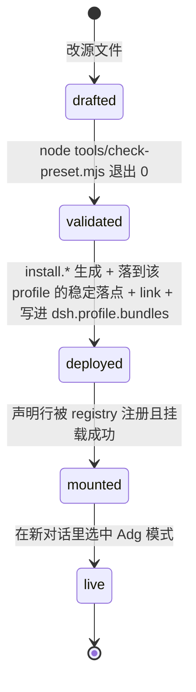

# preset 设计

## 职责与边界

本模块**负责**：Adg 多智能体模式的全部定义 —— 调度 persona（`## 你手上的子代理` 名册 + 分派与验收规则）与 `delegation` 组里那条唯一的委派行（委派行数以 `node tools/check-preset.mjs` 当场报出的为准），以及这三份源文件 `preset/preset.yml` / `preset/agent.cordis.yml` / `preset/bundle.package.json`（它们是 bundle 的唯一真相源，`bundle/` 下的产物由 `tools/gen-preset-bundle.mjs` 生成，不许手改）。

**不负责**：

- 不负责生成与安装：那是 `tools/gen-preset-bundle.mjs` 与 `install.ps1` / `install.sh` 的事。
- 不负责静态校验的判错口径：那是 `tools/check-preset.mjs` 的事（本模块只引用它的判据）。
- 不负责浏览器驱动实现与登录态资产：那是 `browser/` 的事；本模块只写调度者该把哪些命令行契约写进委派。
- 不负责 `notify_user` 的实现与装载：那是 `notify/` 的事；本模块只规定它在哪次委派里、什么时机由谁发。
- 不负责 `delegate` 插件的实现（工具参数、deny 名单、`tools_note` 的形状）：那是 `delegate/` 的事；本模块只规定调度者怎么使用它。
- 不负责 dsh 平台的 composition/realm 机制本身（`@deepseek-ai/*` 的插件语义），只按其契约使用。
- 不负责成本审计脚本：本模块只规定"改动前后各量一次"的口径。
- 不负责给人看的安装与使用说明：那是根 `README.md`。
- 不负责文档写作规范：规范来源按名字引用 `adg-doc-criterion` 技能（`editing-cordis-compositions` 同属这类按名字引用的技能，但它随 `@deepseek-ai/dsh-agent-preset` 包出货，不在本仓库里）。
- 不定义任何固定岗位：子代理每次能干什么，由那条委派行的 `toolFilter.allow`（本 preset 不写它）与 `delegate` 当次给的 `tools` 共同界定，本模块不改平台默认值。

## 依赖关系

**依赖（组合层）**：dsh 的 agent preset 机制 —— Loader 声明 `@deepseek-ai/dsh-agent-preset`、persona 段 `@deepseek-ai/dsh-persona`、子代理与工具面 `@deepseek-ai/dsh-subagent` / `@deepseek-ai/dsh-tool-subagent`、system prompt 按名合并 `@deepseek-ai/dsh-system-prompt` 与作用域 `@deepseek-ai/dsh-scope`。**引用的版本字面量只在根 `AGENTS.md` 的「外部依赖与 ref 解析」一节出现**，本文件不写版本号。

**挂载方式**：本 preset 是一个 **bundle** —— `preset/bundle.package.json` 声明包清单与 `dsh.bundle.patch`，生成物的 patch 里只有一行 `- insert:`，内含一条 Loader 声明（`id: preset-adg`、`name: '@deepseek-ai/dsh-agent-preset'`、`config: {id: adg, name, description, order: 20, plugins: [...源文件原样...]}`）。**同一个 profile 里 `preset-adg` 只能有一个"家"**（bundle 或 profile 补丁二者之一）：两份同 id 的 `insert:` 行是危险形状，不要制造。

**依赖（同仓库）**：`tools/check-preset.mjs`（静态判据）、`tools/gen-preset-bundle.mjs` 与 `tools/flavors.mjs`（味道与注入清单的唯一来源）、`tools/check-bundle-flavor.mjs`（产物侧断言）、`delegate/`（全局工具 `delegate` 的注册方，**唯一委派入口**）、`browser/`（命令行契约）、`notify/`（`notify_user` 的注册方）、`permission/`（`set_child_permission` 的注册方）。

**被依赖**：`skills/adg-delegation/SKILL.md`（改委派能力 / 工具面映射的操作手册）、`install.*`（按探测结果选味道并注册）、根 `README.md`（人向说明）。

**跨模块改动路由**：

| 你要改什么 | 先读 | 再读 |
|---|---|---|
| 委派能力 / 工具面映射 | `skills/adg-delegation/SKILL.md` | 本文件「DelegationRow 与动态工具面」→ `preset/AGENTS.md` 的「红线」 |
| `delegate` 插件本身（工具名 / 参数 / deny 名单 / 装载） | `delegate/AGENTS.md` | `delegate/design.md` 的「对外接口」 |
| 调度 persona 的名册或分派规则 | 本文件「SchedulerPersona」 | `preset/testing-guide.md` 的「用例总表」 |
| composition 的 tool 行或体积旋钮 | 本文件「非功能红线」 | `tools/design.md` 的「非功能红线」 |
| 浏览器那一段 persona | 本文件「SchedulerPersona」 | `browser/design.md` 的「对外接口」→ 根 `README.md` 的「浏览器工具链与登录态资产」 |
| 通知那一段 persona | 本文件「非功能红线」 | `notify/design.md` 的「对外接口」 |

## 核心数据模型

### PresetRevision（生命周期型）

一次"改 preset"的完整生命周期。**它不是什么**：不是一次文件编辑，也不是一次自检通过 —— 文件改了、自检绿了，都还停在前两个状态。

- `drafted` —— 源文本改完、还没自检。**它不是什么**：不是"已生效"。dsh 读的是 profile 里注册的声明行（来自上一次生成的 bundle），源文件改动不会替换已挂载的 preset。
- `validated` —— `node tools/check-preset.mjs` 退出 0。**它不是什么**：不是 YAML 可解析性的证明（它是逐行文本扫描器）、不是"已重新生成"、更不是 `mounted`。
- `deployed` —— `install.*` 跑完：生成该 profile 该拿的那份味道、落到对应稳定落点（`${DSH_HOME:-~/.dsh}/bundles/` 下四个稳定目录之一，目录名由 `tools/flavors.mjs` 的 `dirNameFor(key)` 推导）、`link:` 进 `node_modules`、包名写进该 profile 的 `dsh.profile.bundles`，并按 2b-2 / 4c-4 / 4c-5 步把 `adg-delegate` 装进同一个 profile。**它不是什么**：不是"已挂载"；只看"包在不在"证明不了落点是哪个味道。
- `mounted` —— 声明行被 registry 注册且真的挂载。**唯一判据**：`agentPresets.resolve('adg')` 的 `.broken` 为空。**它不是什么**：不是"已有会话也跟着换"。
- `live` —— 在**新对话**里选中 Adg 模式。**它不是什么**：不是"已经开着的会话会跟着换" —— 预设选择在会话起步时就锁定了。

**迁移唯一入口**：`install.ps1` / `install.sh`，其后由 registry 接续。**禁止绕过**：手工往 `${DSH_HOME:-~/.dsh}/bundles/` 贴文件、手改 `bundle/` 生成物、直接改 profile 的补丁都算绕过，都会让状态与"真相源"脱钩。
**`deployed → mounted` 的触发条件**：profile 补丁或 profile 清单变动会让整份补丁栈重读（`dsh-hmr` 的 `refresh()` 走 `readProfilePatches`）；但"已挂载的会话不会中途换组合"不变 ⇒ 验收口径仍是**重启 + 新对话**。`delegate` 在**全局层**注册（不在本 preset 的 composition 里），所以"bundle 装上了但 `adg-delegate` 没装"的 profile 里调度者手上没有任何委派工具 —— 这条不变量只有 `install.*` 在守。

- 不变量：
  - **I1**：禁止把 `validated` 当 `mounted`（见上：两者的判据不同）。
  - **I2**：禁止没重启 dsh 就宣称已生效。
  - **I3**：禁止手改 `bundle/` 下的任一种味道的生成物，也禁止把 `$DSH_HOME/bundles/dsh-adg-preset*` 当真相源 —— 真相源只有 `preset/` 下那三份源文件。
  - **I4**：改成本结论必须附前后对比数字（改动前后各按 `preset/testing-guide.md` 的「怎么重新测量」跑一次会话审计），且比较看**比例与量级**，不看绝对值。
  - **I5**：`validated` 的判据只能是 `node tools/check-preset.mjs` 退出 0；不能用"我看了一遍"代替。
  - **I6**：禁止在没有前后对比数字时改动体积旋钮（同 I4；旋钮自身见「非功能红线」）。
  - **I7**：composition 里每个 `@deepseek-ai/*` 包名都必须对着**当前安装**核对 —— 包名会随 dsh 升级改名，沿用旧名不让挂载失败，而是让 registry 判**整份 preset `broken`**（`… never started`），模式在新会话直接不可用。**这条是本仓库关于"包名核对"的唯一规定本体**：`preset/testing-guide.md`、`preset/AGENTS.md` 与根 `AGENTS.md` 提到它时只写一行摘要 + 指针（怎么复核见 `preset/testing-guide.md` 的包名核对用例，怎么生效见 `preset/AGENTS.md` 的「生效方式」表）。

### DelegationRow 与动态工具面（不可变值对象）

`preset/agent.cordis.yml` 的 `delegation` 组里那条**唯一的**委派行，属性 `id` / `config.toolName` / `config.provider` / `config.backgroundMode`（当前是 `- id: agent` / `toolName: agent` / `provider: spawn` / `backgroundMode: continuable`，不写 `persona`、不写 `toolFilter`）。它**不是**可以随手改默认值的配置对象：它没有固定岗位，也没有可逐行数出来的专家名册。
子代理**每一次**的目标、边界、验收标准、工具面与可选 persona，由调度者经全局工具 `delegate` 现给（参数 `description` / `prompt` / `tools` / `persona` / `background`）：`tools` 是子代理那次能用的全部工具名，省略＝它继承到的全部；`persona` 只在需要专门视角时才给（平台语义是**遮蔽**该子代理的部署 persona，不是追加）；`background` 缺省 `true`＝后台可续跑。工具名是硬边界：写进 `tools` 的才存在。

- 不变量：
  - **I8**：active 委派行的 `config.toolName` 全文件唯一，且**恰好有一条**的 `toolName` 是 `agent` —— 它就是本 preset 唯一的委派入口（`provider: spawn`、`backgroundMode: continuable` 对它是硬要求）；其余同组行只能以 `disabled: true` 存在。
  - **I9**：工具面只能写已注册的工具名 —— 委派行的 `toolFilter.allow` 里写未知名会让 `restrict()` 抛 `names unknown global tool …`、那次委派当场失败；经 `delegate` 的 `tools` 点名的未知名由插件**剔除后逐条写进 `tools_note`**（不抛错，但不许静默丢掉），`run_code` 一律当场抛错。`bash` / `read_image` / `subagent_codex` / `subagent_claude_code` 是**条件性注册**的名字（目标环境未必有，自检只给 WARN）；构建期注入的那几个名字禁止手写。
  - **I10**：子代理的工具面不得含 `workflow` / `ralph`（`restrict()` 会接受它们、不会让委派失败，但拿到就能绕开委派机制去开任意代理）。
  - **I11**：委派行的 `config.backgroundMode` 必须 `continuable`（本 preset 委派一律后台接续；`delegate` 默认也是后台）。
  - **I12**：委派行不得写 `maxDepth`，`delegate` 也不得给子代理传 `maxDepth`（写 `0` 会让每次委派以 `subagent depth 1 exceeds maxDepth 0` 失败）。
  - **I13**：委派行不得写 `maxTokens` / `agentOptions` / `reasoningEffort`（`reasoningEffort` 在手工声明的路由上报 `UNSUPPORTED_REASONING_EFFORT`）。
  - **I14**：给了 `pwsh` 就必须同时给 `job_list` / `job_output` / `job_kill` —— 这条落在每次现给的 `tools` 上（缺了它们，子代理起的后台作业没有人能收）。
  - **I15**：子代理的工具面不写 `skill`（技能面只归调度智能体）：技能按**渐进式披露**放在 `skills/` 里，需要技能的委派由调度者给出技能文件的**绝对路径** +「先 read 该文件再动手」，不内联、不复述技能正文。写 `skill` 会被自检记为 WARN（它是已注册名，不会让委派失败，但口径上不需要）。
  - **I16**：子代理的工具面不得含任何再开子代理的入口 —— 通用 `subagent` / `subagent_fork`、静态入口 `agent`、动态入口 `delegate`（`adg-delegate` 的 `BUILTIN_DENY` 是这条的载体：子代理能再委派就破坏一跳可达的链路，孙代理对调度者不可见、不可 steer）。
  - **I17**：子代理的工具面不得含 `ask_user_question`（子代理调用它拿 `DELEGATED_CALLER`；该错误文本自己规定要把未决问题写进最终结果）。`notify_user` 相反：**刻意可给**（单向提醒）。
  - **I18**：工具面是真实能力边界 —— 子代理那次可见的工具目录恰好等于它那次的 `tools`（委派行若写了 `toolFilter.allow`，它只减不增、是交集）。**禁止**在 persona 里要求子代理做那次工具面之外的事，也禁止承诺"子代理之间默认能互相转交"。
  - **I19**：禁止给承载体积旋钮的三行（`compaction-basic` / `tool-result-pruner` / `tool-web`）写回覆盖值 —— 本 preset 一律用插件出厂默认值。
  - **I20**：调度 persona 的 `## 你手上的子代理` 名册与 `delegation` 组的 active 委派行**双向一致**：每条 active 委派行的 `toolName` 必须出现在名册里，名册里每个 `agent_…` 提法都必须有对应的委派行。
  - **I21**：名册里禁止写子代理预算（那是把子代理的注意力从"做对"挪到"少写"）。

### SchedulerPersona（不可变值对象）

调度智能体的 persona 段，写在 `preset/agent.cordis.yml` 顶部的 `- id: persona` 行里，只有 `prefix: |-` 一个字段。它是一个**结构固定的文本**：四个大标题 `## 目标` / `## 你手上的子代理`（名册）/ `## 约束` / `## 验收标准`。它**不是**流程脚本：只规定目标、约束、验收标准，不规定每一步的产出与固定格式。

- `## 约束` 由 11 个 **顶级** `【…】` 段组成（拆解立目标 / 要不要派 / 派给谁 / 派几次 / 怎么发 / 委派里写什么 / 技能 / 中转材料 / 浏览器：权限 / 浏览器：模式 / 不确定就问）；数 `【…】` 标记会多数出几个 —— 其中「【拆解立目标】」内含【目标】/【要干什么】/【不要干什么】/【验收标准】四个**子项**，它们是该段的子结构，不是顶级段。
- `## 验收标准` 在位的是**两段**：第 1 段＝按【拆解立目标】里定下的【验收标准】逐条判定的判据；第 2 段＝交付纪律与分段交付。
- 不变量：
  - **I22**：禁止删掉或改写 `## 约束` 与 `## 验收标准` 这两个锚段的内容 —— 判据是**对抗评审**（自检不覆盖锚段内容与在位：`tools/check-preset.mjs` 只做逐行文本扫描，不检查这两个锚段；评审时逐段对照 `preset/agent.cordis.yml` 的调度 persona，判据见 `preset/testing-guide.md` 的「用例总表」里锚段在位与锚段语义那两条用例）。**现行形态是 11 段**：原【需要用户本人的事】段已刻意删除（它的两条必要口径并入【浏览器：模式】与【不确定就问】），除此之外仍禁止增删改写。
  - **I23**：禁止把这两个锚段改写成预算、字数上限或分步流程 —— 它们约束的是"派给谁 / 派几次 / 材料怎么中转 / 写下来的东西怎么组织"，不是"单个子代理能读多少、能写多少"。
- `suffix` 字段**不使用**：段按**名字**合并、"最近作用域的名字覆盖全局"（`@deepseek-ai/dsh-scope` 的 `merge()`：`the nearest scope's entry wins a name`；`@deepseek-ai/dsh-system-prompt` 组装时同名只留一份）、空文本在渲染期被丢弃（同包 `filter((text) => text.length > 0)`），所以本层注册的同名空串段足以遮蔽 global 层那句 `personaSuffix: Your working directory is {{cwd}}.`。**删整行 `- id: persona` 会让那句原样重新显形** ⇒ 只许删 `suffix:` 一个字段行。理由是少一个变量依赖（`{{cwd}}` 来自会话头 `header.cwd`，同一会话内不可改，改动抛 `ApiSessionCwdConflict`；换工作区等于新会话），**不是**修缓存问题。

## 对外接口

- **实现制品**：`preset/agent.cordis.yml`（组合文本，唯一真相源）。
- **模式显示元数据**：`preset/preset.yml` 的顶层标量 `name` / `description` / `order`（`order: 20`）；生成器缺了它们会 exit 1。
- **bundle 生成入口与形状**：`node tools/gen-preset-bundle.mjs [旗标] [<outDir>]` 读那三份源文件，写 `<outDir>/{cordis.patch.yml,package.json}`；patch 内容是一行 `insert:` 内含 Loader 声明行（见「依赖关系」的挂载方式）。味道键、稳定目录名与注入清单的唯一来源是 `tools/flavors.mjs`。
- **委派入口与工具面**：全局工具 `delegate`（由第一方子插件 `adg-delegate` 注册，**只有调度智能体拿得到**）+ `delegation` 组那条唯一委派行 `agent`（`@deepseek-ai/dsh-tool-subagent`）。调度者能派谁**不是一个固定名单**：它每次现给 `tools` 与可选 `persona`，不另建契约副本；`delegate` 的参数与 deny 名单以 `delegate/design.md` 为准。

## 非功能红线

每条一行结论 + 来源 + 理由 + 载体（`[机检]`＝脚本可判 / `[评]`＝需人读文本判断 / `[人]`＝需真实运行或人操作）。编号在本表内连续、没有空号。「禁止给三行体积旋钮写回覆盖值」与「禁止把交付侧证据落点判据简化成让子代理自报」这两项判据同属一行结论，在本表里叫 R3、在 `preset/AGENTS.md` 的「红线」表里叫红线 3 —— 两处指同一条，载体不同，见该行右列（那边是同一批结论的模块内清单，别按编号把两处的条数对上）。

| # | 结论 | 来源 | 载体 |
|---|---|---|---|
| R1 | 禁止加回通用 `subagent` / `subagent_fork` 委派行。理由：子代理继承父代理的整套 composition，一旦存在通用行，子代理就能绕过委派机制再开一个不受限的子代理；`delegation` 组只留一条静态入口是第二道保险。 | 组合文本 + `tools/check-preset.mjs` | `[机检]` |
| R2 | 工具面（委派行的 `toolFilter.allow` 与 `delegate` 的 `tools`）是真实能力边界，不是提示（见 I18）—— 禁止在 persona 里要求子代理做那次工具面之外的事，禁止承诺子代理互相转交。 | `tools/check-preset.mjs` 的名字校验 + 一次真实委派 | `[机检]`+`[人]` |
| R3 | 禁止给三行体积旋钮写回覆盖值（见 I19），并禁止把交付侧的证据落点判据（按【拆解立目标】里的【验收标准】逐条判定）简化成"让子代理自报"。理由：截断工具结果会把工具**已经取到**的事实切掉，子代理只能重取、换查询或拿残缺证据下结论，三者都比不裁更贵；而拿不出前后对比数字就无法判断改动是否真的省了成本。这一行覆盖两项判据，两半的载体不同，见右列。 | 本 preset 的组合文本 | 旋钮那一半：`tools/check-preset.mjs` 的旋钮行检查 `[机检]`；交付侧证据落点判据那一半：对抗评审 `[评]` + `tools/check-preset.mjs` 的 persona 段存在性检查 |
| R4 | 禁止在 persona 里写 token / 读取预算或字数次数上限。理由：那是把子代理的注意力从"做对"挪到"少写"。 | `## 约束` 与 `## 验收标准` 的锚段 | `[评]` |
| R5 | 禁止把 `agent` / `delegate` / `workflow` / `ralph` / `set_child_permission` / `ask_user_question` 从 `adg-delegate` 的 `BUILTIN_DENY` 里删掉、放宽或绕过，或经 `delegate` 的 `tools` 把它们发给子代理（见 I10 / I16 / I17）。理由：前四个都能再开子代理，一放就破坏一跳可达的链路，并让承载编排约束的那几段整段失效。 | `delegate/AGENTS.md` 的 R1 + 组合文本 | `[机检]` |
| R6 | 禁止给委派行写 `maxDepth`，也禁止 `delegate` 给子代理传 `maxDepth`（见 I12：`subagent depth 1 exceeds maxDepth 0` 会让每次委派失败）。 | 组合文本 + `delegate/AGENTS.md` 的 R6 | `[机检]` |
| R7 | 禁止给任何请求设 `maxTokens` / `agentOptions` / `reasoningEffort`（见 I13）。理由：输出只占账单很小一份，压它损伤质量。 | 组合文本 | `[机检]` |
| R8 | 工具面只能写已注册的工具名（见 I9）。理由：`dsh-tools` 的 `restrict()` 遇到未知名直接抛 `names unknown global tool …`。 | `tools/check-preset.mjs` 的 `KNOWN_TOOLS`（合法名单的唯一来源）+ `delegate/AGENTS.md` 的 R2 / R3 | `[机检]` |
| R9 | 构建期注入组的名字只能由构建期注入，禁止手写进源文件 —— 目前两组：billion-context 的 `compress` / `decompress` / `search_context` / `acp_status`（同属该插件的 `acp_cache` 故意不注入），以及 save-token 的 `save_token_expand`。理由：两头都是缺陷 —— **不给**时那两个插件的指令与通知只看自己的 config、不看这个请求有没有那些工具，子代理会收到"去调某个工具"却没有工具可调；**给了但目标 profile 没装那个插件**时名字不存在，撞 R8，每次委派当场抛错。所以口径是"源文件中立、生成物按探测决定"。 | 清单唯一来源 `tools/flavors.mjs` 的 `INJECTION_GROUPS` | `[机检]` |
| R10 | 禁止删掉或绕过浏览器任务的权限闸门。理由：浏览器驱动在受限文件策略下会失败（表现为非零退出码与 `拒绝访问` 一类错误），而子代理的权限在**委派那一刻**被捕获、子代理不能自升权 —— 所以闸门的做法是让调度者在派发前把环境交代清楚。**事后补救**只有两条路：父代理调 `set_child_permission`（血缘与"不得高于调用方"两条守卫在代码里，见 `permission/design.md`），或停掉重派；禁止把闸门写成"切完权限旧子代理就自动能用"。 | 组合文本 + 一次真实委派 | `[评]`+`[人]` |
| R11 | 禁止把权限闸门写成"权限强制"或安全边界。理由：它是**提示级**的；写成强制会让调度者放弃如实交代环境，反而更容易在受限环境里白跑一轮。同样禁止把补救路径写成"父代理一定能给子代理升到完全权限"：`set_child_permission` 的代码守卫只管**不得超过调用方自己**（父代理自己没升上去时它会当场拒绝，不会替谁兜底）。 | 组合文本 | `[评]` |
| R12 | 禁止把 `ask_user_question` 加进子代理的工具面，也禁止要求子代理自己问用户（见 I17）。理由：子代理调用它拿 `DELEGATED_CALLER`，该错误文本自己规定要把未决问题写进子代理的最终结果；人工介入这件事由调度者做，**没有次数上限**。 | 组合文本 + `adg-delegate` 的 `BUILTIN_DENY` | `[机检]`+`[评]` |
| R13 | 禁止把"请用户手动登录"写成失败路径，也禁止在派发前预先禁止登录。理由：那是浏览器任务的**正常入口** —— 用户在自己的机器上登录是唯一合法途径，子代理只负责提醒与等待。 | 组合文本 + `## 约束` 的【浏览器：模式】段 | `[评]` |
| R14 | 禁止删掉编排层规则：同一实体 + 同一性质的任务合并成一次委派（浏览器那半：同一份信息默认只在一个站点取）、同一实体的后续任务接给已经读过它的那个子代理（`send_message`）、跨子代理传递大材料走 digest、派发前过必要性闸门并给未纳入的旁路挂号。理由：这些是实践踩过的坑 —— 合并省的是重复读取，接续省的是重新建立上下文，挂号省的是"看起来做了其实没做"。 | 组合文本 `## 约束` 的第 ①② 段 | `[评]` |
| R15 | 禁止把未纳入的旁路静默丢掉：最终答复里必须有挂号句"未纳入本次：X（可能影响 Y，未调研）"。理由：静默丢弃会让读交付的人以为范围已覆盖。 | 组合文本 `## 约束` 的必要性闸门段 | `[评]` |
| R16 | digest 工件只落平台临时根、任务结束即删；read-only 环境不造工件。理由：工件写进工作区或仓库会污染交付物，没删就说已清理是假报告。 | 组合文本「中转材料」段 | `[评]`+`[人]` |
| R17 | 禁止把输出纪律改写成字数上限，也禁止省掉"未验证 / 未纳入"块。理由：交付要能被人逐条复核，删掉这两块等于把不确定性藏起来。 | 组合文本 `## 验收标准` 第 2 段 | `[评]` |
| R18 | 委派一律走后台（`delegate` 默认 `background: true`），没有"阻塞等待"的例外，也不许用 `pwsh` 睡眠 / 轮询等它跑完（派完就结束本轮，子代理结束时的结算通知会把你唤起）。理由：前台一次性委派不进 `list_agents`、后续 `send_message` 报 `NOT_RESUMABLE`，等于把一次可接续的委派变成一次性调用。 | 组合文本 + `delegate/design.md` 的 `kind` + `list_agents` 的行为 | `[评]`+`[人]` |
| R19 | 浏览器运行模式由**调度者**在派发前判定，不为此问用户：完全确定不需要登录 / 验证码 → 无头；确定需要 → 有头；拿不准 → 先无头，真正撞上登录墙 / 验证码时再换成有头。判定的结果写进委派文本。理由：模式决定用户能不能看见窗口，但每个任务都问一遍是把人的判断变成打扰，而"拿不准先无头、撞墙再升级"本来就是登录协议的路径 —— 工具层的默认（`headless`）不得被改，换模式仍必须显式且只有一条换法。 | 组合文本「浏览器：模式」段 | `[评]` |
| R20 | 中途需要人工介入时，子代理用 `notify_user` 发一条**单向**提醒（不阻塞、不等回话），并按技能里的登录协议把"需要用户人工介入"写进它的最终结果报回调度者。理由：单向提醒只解决"人不在电脑前看不到"，不能代替调度者与人对话；`notify_user` 因此刻意留在 `delegate` 可给的工具里。 | `notify/design.md` 的「对外接口」＋ `delegate` 的可给名单 | `[评]` |
| R21 | 截图能力（`read_image`）属**条件性注册**：目标环境未注册时它只是个 WARN，不保证可用。理由：把它当稳定能力写进流程会让子代理在未注册的环境里反复失败。 | `tools/check-preset.mjs` 的 `CONDITIONAL_TOOLS` | `[机检]` |

**未观测**：调度者是否真的每次都执行浏览器任务的权限闸门；量法：抽若干浏览器任务，转写里看 `ask_user_question` 是否出现在任何浏览器委派之前，并核对当时的文件策略行。

**未观测**：用户在浏览器任务中途切换权限后，调度者是否真的去补权限；量法：抽一次"先受限、后切换"的浏览器任务，看转写里是否出现 `set_child_permission`（而不是干等旧委派或直接重派），并核对它没有把权限改到超过自己当时的权限。

**未观测**：编排层规则（合并 / 接续 / 挂号）是否真的被遵守；量法：观测量＝子代理个数、步数的 p50 与 p90（比分位数，不比均值）、审计脚本按 preset 分组的请求数、挂号抽查。

**未观测**：调度者是否真的"不确定就问用户"，以及子代理报回的人工介入是否真的被转达出去；量法：抽任务看转写里出现的是提问还是自行假设，并核对子代理最终结果里的未决问题是否在调度者的下一轮里出现（该转达口径现由 `skills/adg-browser-use` 的登录协议与【不确定就问】承担，调度 persona 里已不再单列一段）。

**未观测**：调度者给的 `tools` 是否真的等于子代理那次的可见工具目录，以及被剔除的未知名是否逐条落在 `tools_note` 里；量法：派一次子代理，在 `tools` 里混入一个未注册名与 `agent` / `delegate`，读返回的 `tools` / `tools_note`，再让子代理报一次它自己的工具目录。

## For Agents

动手前先读 `preset/AGENTS.md` → 本文件 → 视改动读 `skills/adg-delegation/SKILL.md` 或 `delegate/AGENTS.md`。

- **绝不能做**：上面「非功能红线」表里的任何一条（逐行读完再动手，不要只数条数）；把 `validated` 当 `mounted`（I1）；没重启就宣称生效（I2）；手改 `bundle/` 生成物（I3）。
- **停止并升级人类**：要推翻既有语义（例如改"工具面是真实边界"这个前提）；红线之间冲突；需求超出本模块边界（生成/安装/浏览器实现/通知实现/`delegate` 实现）；要改体积旋钮却拿不出前后对比数字。

## 测试与验证

验证方式、用例全表、迁移矩阵、消费方契约测试、人工 review 项与"怎么重新测量"都在 [`testing-guide.md`](testing-guide.md)。**未观测**事项就地写在本文件与 `testing-guide.md` 的相关小节里，不集中成台账。
